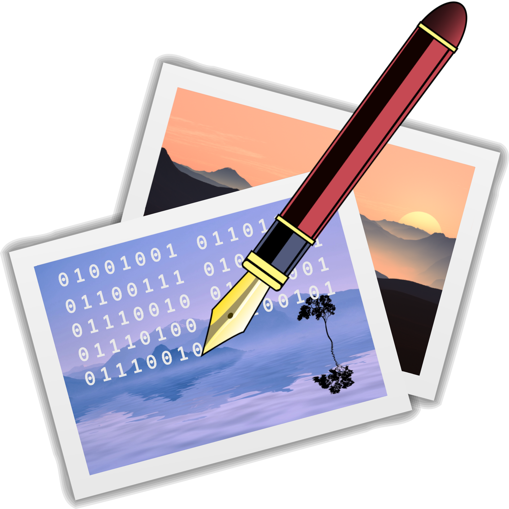
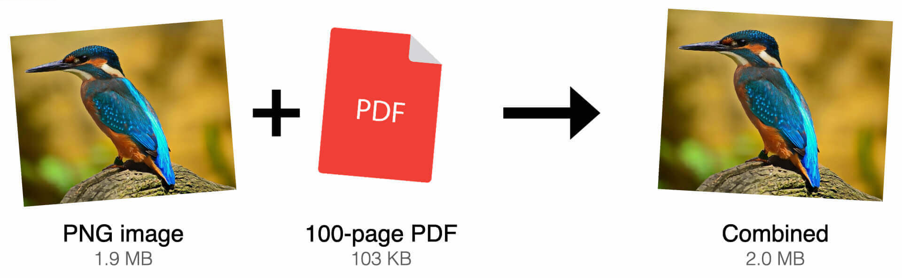

# ImgWriter
<!-- Copyright (c) 2022 Pyry Lahtinen -->

  

*Store data inside images.* Save text, PDF, audio or any other kind of data inside an image and extract it later. Human eye cannot see the changes that the program does to the mother image.

The process does not significantly increase the file size. In fact, the result image may sometimes be smaller than the original one due to little optimization.

